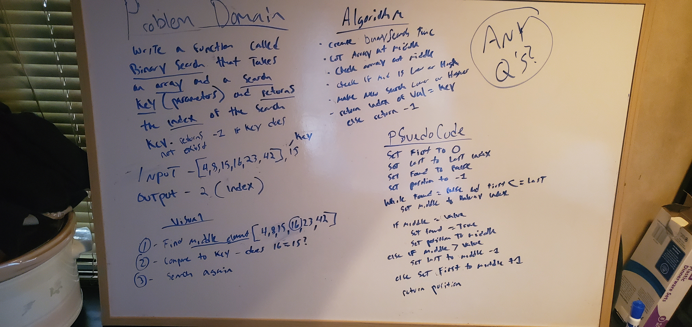

# Array-Reverse
# Array Binary Search
<!-- Short summary or background information -->

## Challenge
<!-- Description of the challenge -->
- Write a function called BinarySearch which takes in 2 parameters: a sorted array and the search key. 

## Approach & Efficiency
<!-- What approach did you take? Why? What is the Big O space/time for this approach? -->
- 

## Solution
<!-- Embedded whiteboard image -->

## Notes

