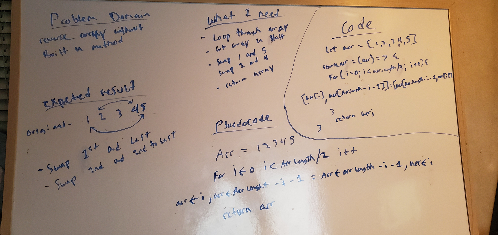

# Array-Reverse
# Reverse an Array
<!-- Short summary or background information -->

## Challenge
<!-- Description of the challenge -->
- Reverse and array without using any build in methods.

## Approach & Efficiency
<!-- What approach did you take? Why? What is the Big O space/time for this approach? -->
- I decided on reversing the array of numbers by swapping the numbers to the numbers in its correspoding place because I have never done it and wanted to learn a new technique. O(n)O(1)

1<=>5, 2<=>4, ECT.

## Solution
<!-- Embedded whiteboard image -->

## Notes

8/10/2020 3:28am

Did the white board and decided on a new array reverse method that I have never done before. I found the method online and noticed after doing it and then whiteboarding it, I started understand how the function works. 

Doing the whiteboard part was somewhat difficult because i wasnt sure how to write the psuedoCode so I just took a stab at it.

after some trial and error i got my function to work. I tried adding some more complexity to it but changed my mind after about an hour. 
