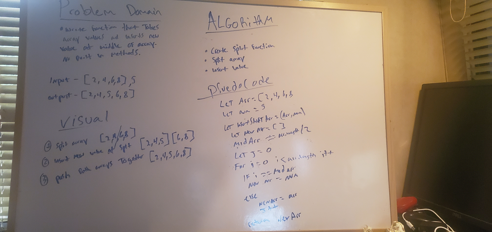

# Array-Shift
<!-- Short summary or background information -->
Insert and Shift and Array in middle of Index

## Challenge
<!-- Description of the challenge -->
- Write a function called insertShiftArray that takes array values and inserts new value at the middle of array. Do not use any built in methods. 

## Approach & Efficiency
<!-- What approach did you take? Why? What is the Big O space/time for this approach? -->
- 

## Solution
<!-- Embedded whiteboard image -->

## Notes