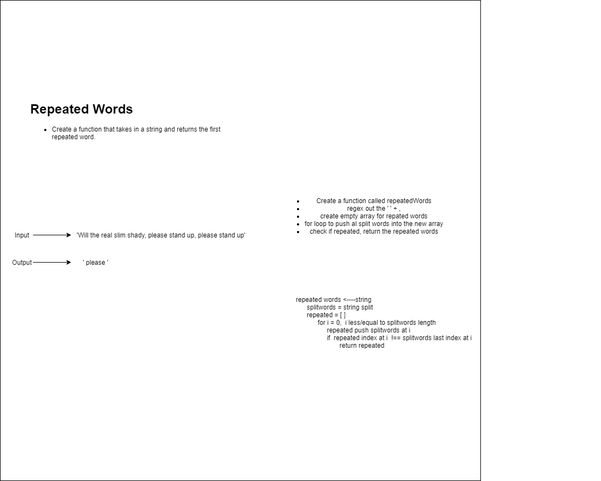

# Challenge Summary
<!-- Short summary or background information -->

## Challenge Description
<!-- Description of the challenge -->

Write a function that accepts a lengthy string parameter.
Without utilizing any of the built-in library methods available to your language, return the first word to occur more than once in that provided string.
## Approach & Efficiency
<!-- What approach did you take? Why? What is the Big O space/time for this approach? -->

I think it is an O(n) efficiency because of the for loop not knowing how big an array is.

## Solution
<!-- Embedded whiteboard image -->

I did use push and indexOf as well as lastIndexOf. I still dont know how they work at the basic javascript level, I had to reasearch this problem, I know what I want to do, just making the code like split work without the split method is difficult. 

