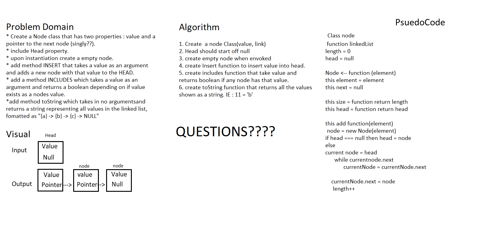

# Linked-Lists
# Linked List code challenge 05
<!-- Short summary or background information -->

## Challenge
<!-- Description of the challenge -->
- Create a Node class that has properties for the value stored in the Node, and a pointer to the next Node.
Within your LinkedList class, include a head property. Upon instantiation, an empty Linked List should be created.
 - Define a method called insert which takes any value as an argument and adds a new node with that value to the head of the list with an O(1) Time performance.
 - Define a method called includes which takes any value as an argument and returns a boolean result depending on whether that value exists as a Node’s value somewhere within the list.
 - Define a method called toString (or __str__ in Python) which takes in no arguments and returns a string representing all the values in the Linked List, formatted as:
"{ a } -> { b } -> { c } -> NULL"

## Approach & Efficiency
<!-- What approach did you take? Why? What is the Big O space/time for this approach? -->
- I Had to look up how to even do a Linked List just to know exactly how nodes are working. After that I whiteboarded everything, the PsuedoCode is based on an example I found as I am still learning how it all works. 

## Solution
<!-- Embedded whiteboard image -->

## Notes

8/21/2021 5:51am

- I had to look up alot about linked lists to undertsand them. My whiteboard PsuedoCodse is based off a video I found explaining linked lists so Im not sure how accurate it will be. I think I can do it based on what I was learning. 