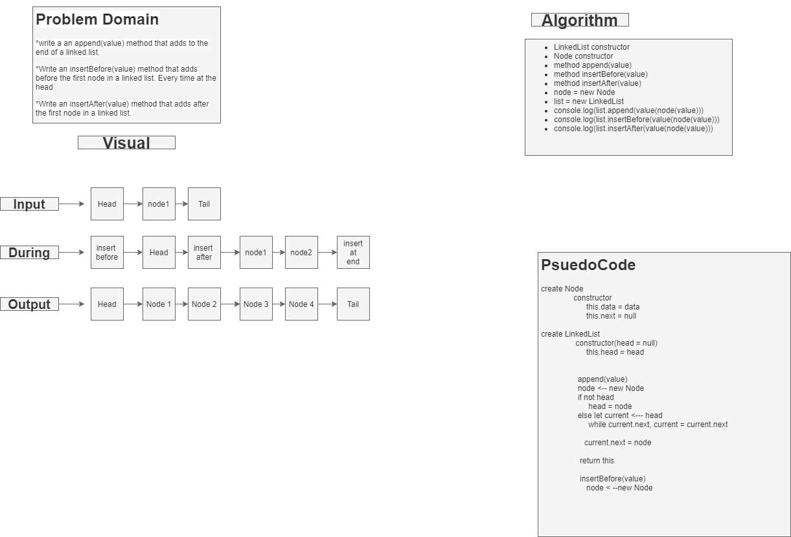

# Linked-Lists
# Linked List Insertions
<!-- Short summary or background information -->

## Challenge
<!-- Description of the challenge -->

create 3 methods
Append() - takes a node(value) and adds to end of list
insertBefore() takes a node(value) and adds before first node
insertAfter() takes a node(value) and adds after first node;

## Approach & Efficiency
<!-- What approach did you take? Why? What is the Big O space/time for this approach? -->
- built out 3 methods in the list constructor

## Solution
<!-- Embedded whiteboard image -->

## Notes

8/24/2021 9:55pm

- Still not finished, Need to finish my methods and write out my code and finish whiteboard. 