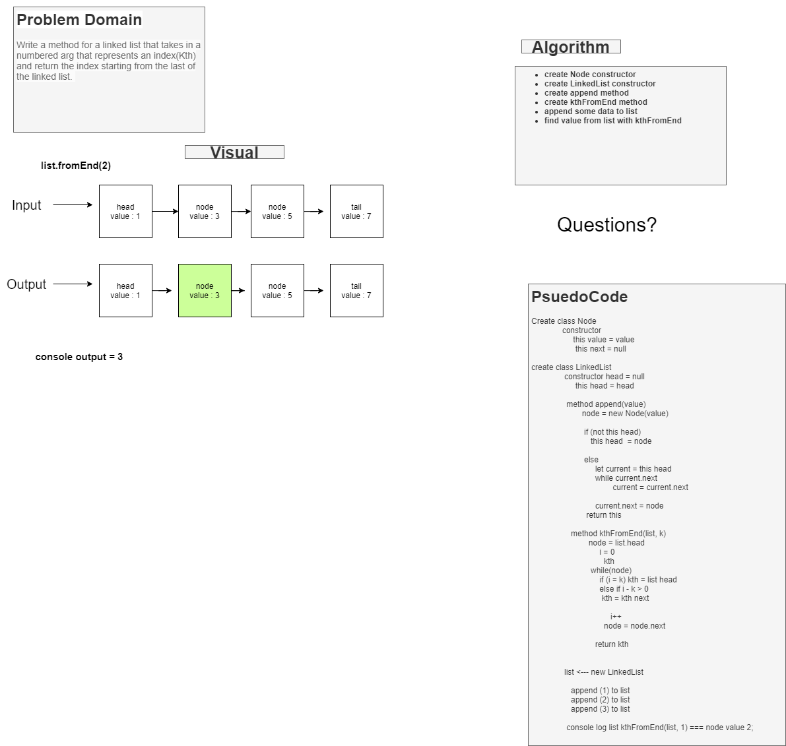

# Linked-Lists
# Linked List kth from end
<!-- Short summary or background information -->

## Challenge
<!-- Description of the challenge -->
Write a method for a linked list that takes in a numbered arg that represents an index(Kth) and return the index starting from the last of the linked list. 

## Approach & Efficiency
<!-- What approach did you take? Why? What is the Big O space/time for this approach? -->
- Havent finished it yet, not even sure where to start 
i think i am going to scaffold out the linked list for starters before I add any methods. then add an insert method and then add several new nodes then traverse through the nodes. 

## Solution
<!-- Embedded whiteboard image -->

## Notes

8/24/2021 9:55pm

- not even close to finished, this one was very hard to understand what i needed to do. After about an hour, i understood what the problem is. it actually wants a number but there is a letter in the argument. 