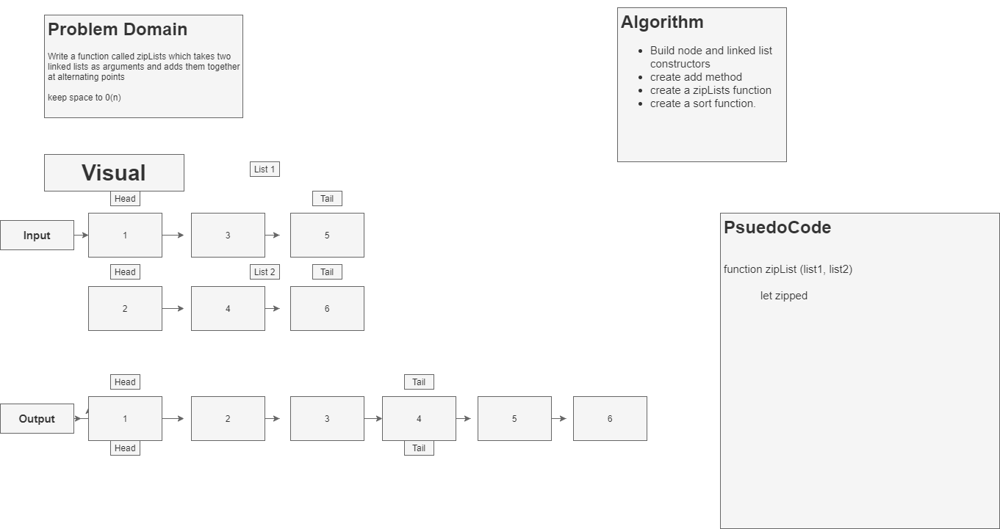

# Linked-Lists
# Zip-Lists
<!-- Short summary or background information -->

## Challenge
<!-- Description of the challenge -->
- Write a function called zipLists which takes two linked lists as arguments. Zip the two linked lists together into one so that the nodes alternate between the two lists and return a reference to the head of the zipped list. Try and keep additional space down to O(1). You have access to the Node class and all the properties on the Linked List class as well as the methods created in previous challenges.

## Approach & Efficiency
<!-- What approach did you take? Why? What is the Big O space/time for this approach? -->
- I Found an algorithm that merges two linked lists togeter but doesnt sort. I need to figure out a good way to sort the lists now. I think the sort method wont work because I need to create a new linked list out of the 2 linked lists. 

## Solution
<!-- Embedded whiteboard image -->

## Notes

8/31/2020 

Time 8:52pm

- Having trouble figuring out how im going to code this. Ive looked online and cant find anything other than a merge sort. I think I am going to go with that solution. Im just worried I am not retaining alot of this information. 