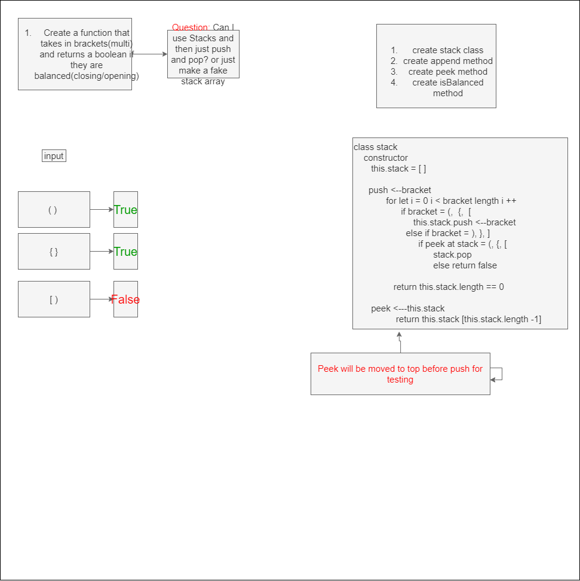

# Multi Bracket Validation
# Multi Bracket Validation
<!-- Short summary or background information -->

## Challenge
<!-- Description of the challenge -->
- Create a function called multiBracketValidation that takes in a value and checks whether it is balanced. return true for balanced and false for unbalanced

## Approach & Efficiency
<!-- What approach did you take? Why? What is the Big O space/time for this approach? -->
- I decided I want to try to use a stacks class to iterate through the array and then either add or pop some information. I will be using the peek to check if something is going to be true if I add it or return false if it doesnt match. The way I saw it done was with 2 seperate functions but I want to try it with stacks class. The big O is O(n) I believe because of the one for loop. 

## Solution
<!-- Embedded whiteboard image -->

## Notes