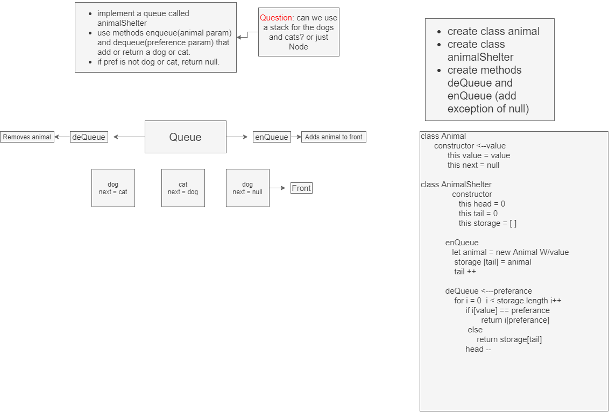

# Fifo Animal Shelter
<!-- Short summary or background information -->

## Challenge
<!-- Description of the challenge -->
- Create a class called AnimalShelter which holds only dogs and cats. The shelter operates using a first-in, first-out approach.
 - Implement the following methods:
      - enqueue(animal): adds animal to the shelter. animal can be either a dog or a cat object.
      - dequeue(pref): returns either a dog or a cat. If pref is not "dog" or "cat" then return null.

## Approach & Efficiency
<!-- What approach did you take? Why? What is the Big O space/time for this approach? -->
- I made a animal class constructor that was instantiated inside the AnimalShelter class. I then append deQueue and enQueue to add a new dog or cat, then loop through the queue to check for preferance and then return. O(n). 

## Solution
<!-- Embedded whiteboard image -->

## Notes

9/14/2020 

- finished whiteboard, just need to code out my psudocode. 

