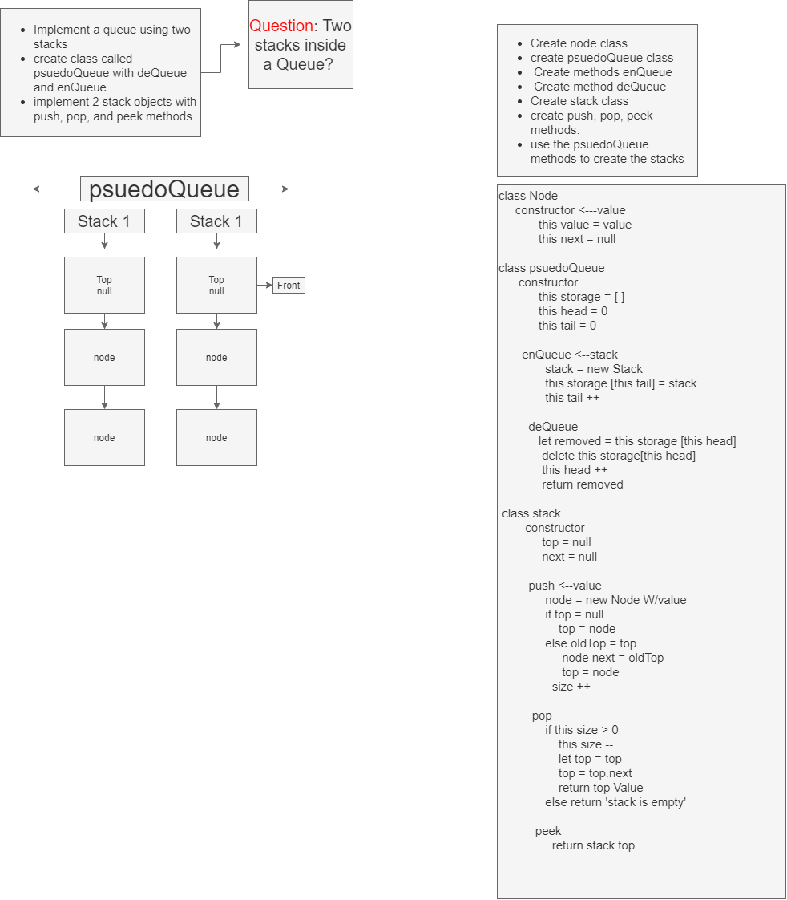

# Queues With Stacks
<!-- Short summary or background information -->

## Challenge
<!-- Description of the challenge -->
- Create a brand new PseudoQueue class. Do not use an existing Queue. Instead, this PseudoQueue class will implement our standard queue interface (the two methods listed below), but will internally only utilize 2 Stack objects. Ensure that you create your class with the following methods:

-enqueue(value) which inserts value into the PseudoQueue, using a first-in, first-out approach.
-dequeue() which extracts a value from the PseudoQueue, using a first-in, first-out approach.
The Stack instances have only push, pop, and peek methods. You should use your own Stack implementation. Instantiate these Stack objects in your PseudoQueue constructor.

## Approach & Efficiency
<!-- What approach did you take? Why? What is the Big O space/time for this approach? -->
- I will be creating the psudoqueue then using the enque and dequeu methods. Inside my stacks I will be using the pop, push, peek methods to check the actual data that is stored in the Queue.

## Solution
<!-- Embedded whiteboard image -->

## Notes

9/14/2020 9:02pm

- finished whiteboard, setup scaffolding.
