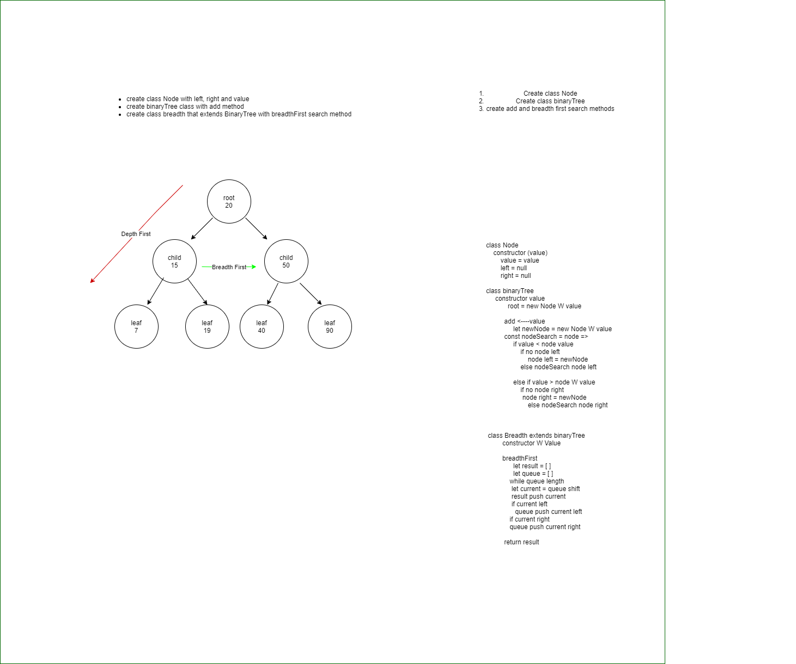

# Trees
<!-- Short summary or background information -->

## Challenge
<!-- Description of the challenge -->
Search through the tree using breadth search

## Approach & Efficiency
<!-- What approach did you take? Why? What is the Big O space/time for this approach? -->

I used the same add method as before, then extending the class with breadth and added method breadthFirst. I think its 0(n) because of the while loop. 

## Solution
<!-- Embedded whiteboard image -->

## Notes

10/4/2020 6:30pm

- finished whiteboard, Lookin at the requirements, i noticed I needed to extend the class so i changed to that similar to the other code challenge. I think i want to make another class that extends and adds to the original class and just use all my methods that way. I think this way im doing it is just making everything very....messy i guess.