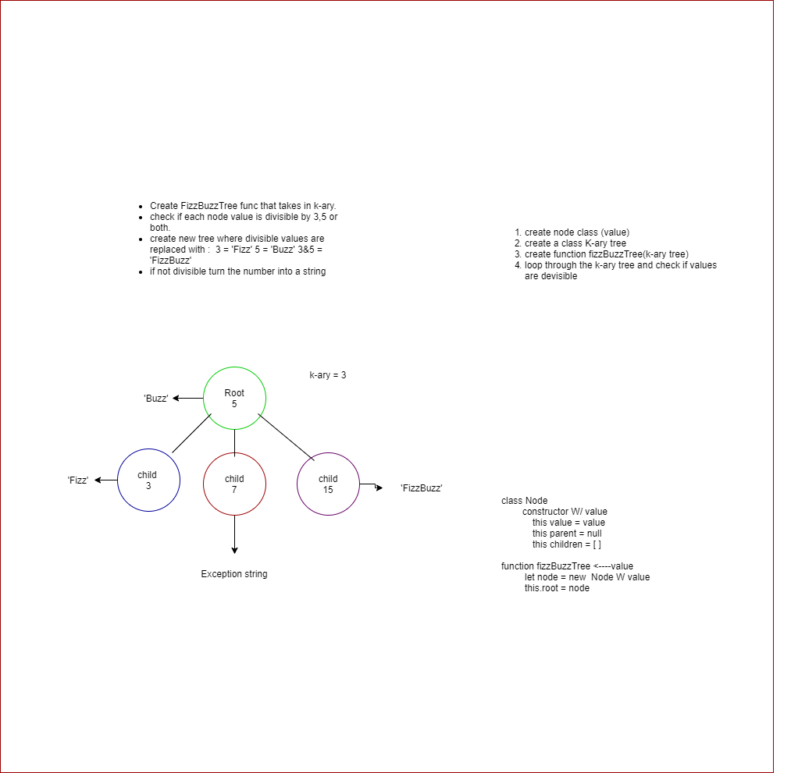

# Trees
<!-- Short summary or background information -->

## Challenge
<!-- Description of the challenge -->
Write a function called FizzBuzzTree which takes a k-ary tree as an argument.
Without utilizing any of the built-in methods available to your language, determine whether or not the value of each node is divisible by 3, 5 or both. Create a new tree with the same structure as the original, but the values modified as follows:
If the value is divisible by 3, replace the value with “Fizz”
If the value is divisible by 5, replace the value with “Buzz”
If the value is divisible by 3 and 5, replace the value with “FizzBuzz”
If the value is not divisible by 3 or 5, simply turn the number into a String.
Return a new tree.

## Approach & Efficiency
<!-- What approach did you take? Why? What is the Big O space/time for this approach? -->

I am attempting to add some data in to the makeshift tree and then use some functionality inside the function to check the values if they are divisible. 

I would like to steer away from any loops or at least only use 1 while loop to give the big O a O(n)

## Solution
<!-- Embedded whiteboard image -->

## Notes

10/12/2020 7:41pm

- halfway through whiteboard, trying to understand how to implement the tree without using built in methods from the function. 
