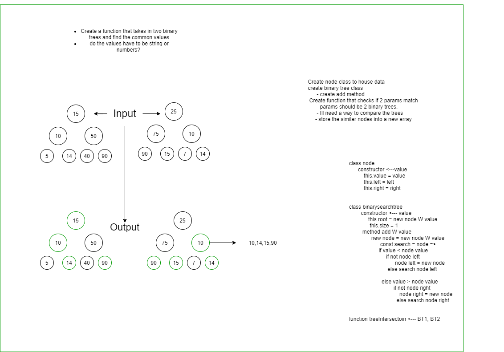

# Challenge Summary
<!-- Short summary or background information -->
Find common values in 2 binary trees.

## Challenge Description
<!-- Description of the challenge -->
Write a function called tree_intersection that takes two binary tree parameters.
Without utilizing any of the built-in library methods available to your language, return a set of values found in both trees.
Structure and Testing

## Approach & Efficiency
<!-- What approach did you take? Why? What is the Big O space/time for this approach? -->

I started by making the tree class and node class. I know I want to search through both trees and compare each node value. I think the best apporach would be to just store all the value from each into the same array then traverse through the array and look for duplicates. Im also thinking maybe I can just do maybe like a next checker or something. I havent quite finished the function, Im still confused aobut how to actually search through a tree without a for loop. 

## Solution
<!-- Embedded whiteboard image -->
