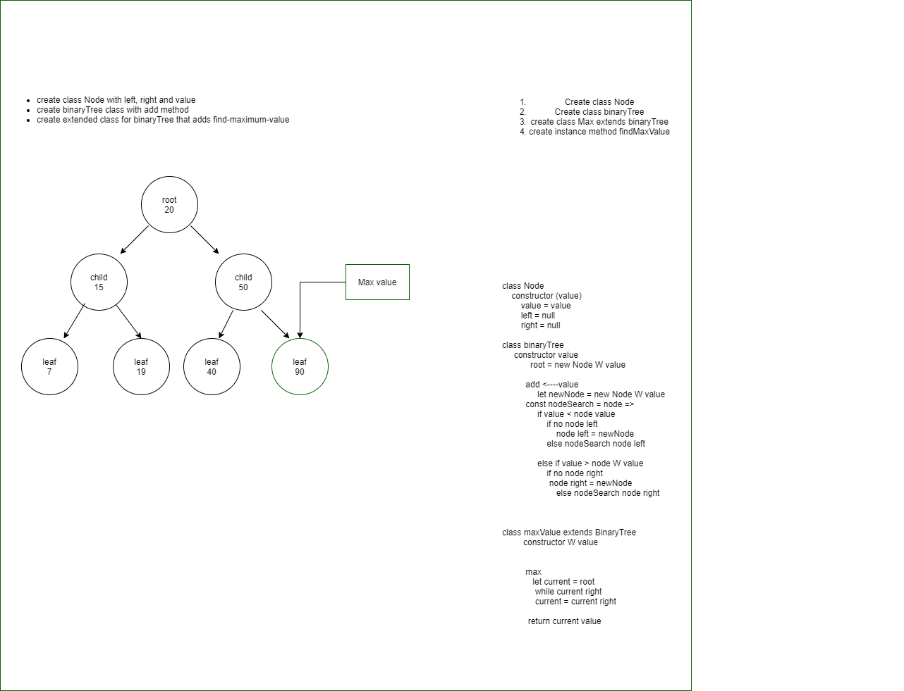

# Trees
<!-- Short summary or background information -->

## Challenge
<!-- Description of the challenge -->
Find the Max Value in the Tree

## Approach & Efficiency
<!-- What approach did you take? Why? What is the Big O space/time for this approach? -->

I used the same methods for adding that I did for the last one because it presorts it in left and right then i extended the class using adding a maxValue method. I think its 0(n) because of the while loop.

## Solution
<!-- Embedded whiteboard image -->

## Notes

10/4/2020 5:57pm

- finished whiteboard, not sure if it will work, but i think i can just extend the class per assignment. The other way would be to just add another method to the class which I think would be easier, but i can see the benefit of doing it this way as then anyone can just extend off the class without modifying the original class. 
